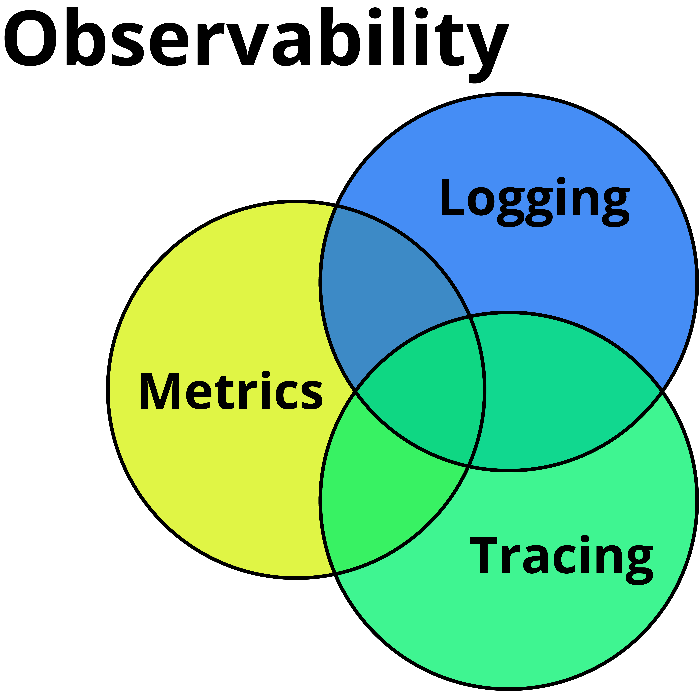

# Armory Observability Plugin

Spinnaker plugin for configuring and customizing observability.

## What is Observability?

In control theory, observability is a measure of how well internal states of a system can be inferred from knowledge of its external outputs. The observability and controllability of a linear system are mathematical duals. 

The concept of observability was introduced by Hungarian-American engineer Rudolf E. Kálmán for linear dynamic systems.



In software metrics, logging and tracing make up the core categories of observability

## What does this plugin do?

- Enables customizing and tweaking the Micrometer registry.
- Exposes an [OpenMetrics](https://openmetrics.io/) endpoint for the Micrometer/Spectator metrics
  - This allows tools such as Promethous or the New Relic OpenMetrics integration to work without the [Spinnaker Monitoring Daemon](https://github.com/spinnaker/spinnaker-monitoring/tree/master/spinnaker-monitoring-daemon).

## Potential Future Additions
- Enable distrubuted tracing, Slueth?
- Customize logging to filter noise or have custom appender for shipping important logs to log aggregator
- Customize Error handling? Can we enable something like [Backstopper](https://github.com/Nike-Inc/backstopper) in a plugin? I have no idea ¯\\_(ツ)_/¯.

## Plugin Configuration

### Condensed Example
```yaml
spinnaker:
  extensibility:
    plugins:
      Armory.ObservabilityPlugin:
        enabled: true
        config.metrics:
          additionalTags:
            customerName: armory
            customerEnvName: production
          prometheus.enabled: true
```

### All Options
```yaml
spinnaker:
  extensibility:
    plugins:
      Armory.ObservabilityPlugin:
        enabled: true
        config:
          metrics:
              # Key value map of extra static default tags to add when generated the default tags
              # Optional, Default: empty map
              additionalTags:
                  # Human Readable Customer name for dashboarding.
                  # Optional, Default: omitted from default tags
                  customerName: armory
                  # Human Readable Customer Environment name for dashboarding.
                  # Optional, Default: omitted from default tags
                  customerEnvName: production
                  # Halyard generated UUID for non-managed and non-sass customers
                  # Optional, Default: omitted from default tags
                  customerEnvId: e0fb0422-aa8e-11ea-bb37-0242ac130002
              
              # By default this plugin adds a set of sane default tags to help with observability best practices, you can disable those here
              # Optional, Default: false
              defaultTagsDisabled: false
              
              # By default this plugin does some sane filtering and transformations on metrics, you can disable those here
              # Optional, Default: false
              meterRegistryFiltersDisabled: false
    
              prometheus:
                # Optional, Default: false
                enabled: false
                # The step size to use in computing windowed statistics like max.
                # To get the most out of these statistics, align the step interval to be close to your scrape interval.
                # Optional, Default: 30
                stepInSeconds: 30
                # true if meter descriptions should be sent to Prometheus.
                # Turn this off to minimize the amount of data sent on each scrape.
                # Optional, Default: false
                descriptions: false
        
              newrelic:
                # Optional, Default: false
                enabled: false
                # The new relic api key
                # Required if newrelic is enabled
                apiKey: encrypted:secrets-manager!r:us-west-2!s:my-secrets!k:new-relic-api-key
                #The URI for the New Relic metric API. Only necessary if you need to override the default URI.
                # Optional, Default: https://metric-api.newrelic.com/
                uri: https://metric-api.newrelic.com/
                # Turn on "audit mode" in the underlying New Relic Telemetry SDK. This will log all data sent to
                # the New Relic APIs. Be aware that if there is sensitive information in the data being sent that
                # it will be sent to wherever the Telemetry SDK logs are configured to go.
                enableAuditMode: false
                # How often in seconds you want to send metrics to New Relic
                # Optional, Default: 30
                stepInSeconds: 30 
                # The number of threads to use with the scheduler.
                # Optional, Default: 2
                numThreads: 2 
                # The number of measurements per request to use for the backend. If more
                # measurements are found, then multiple requests will be made.
                # Optional, Default: 10000
                batchSize: 10000 
    repositories:
      armory-observability-plugin-releases:
        url: https://raw.githubusercontent.com/armory-plugins/armory-observability-plugin-releases/master/repositories.json            
```

## Development

1) Run `./gradlew releaseBundle`
2) Put the `/build/distributions/pf4jPluginWithoutExtensionPoint-X.zip` in the [configured plugins location for your service](https://pf4j.org/doc/packaging.html).
3) [Configure the plugin Spinnaker service.](#plugin-configuration)

To debug the plugin inside a Spinnaker service (like Orca) using IntelliJ Idea follow these steps:

1) Run `./gradlew releaseBundle` in the plugin project.
2) Copy the generated `.plugin-ref` file under `build` in the plugin project submodule for the service to the `plugins` directory under root in the Spinnaker service that will use the plugin .
3) Link the plugin project to the service project in IntelliJ (from the service project use the `+` button in the Gradle tab and select the plugin build.gradle).
4) Configure the Spinnaker service the same way specified above.
5) Create a new IntelliJ run configuration for the service that has the VM option `-Dpf4j.mode=development` and does a `Build Project` before launch.
6) Debug away...
